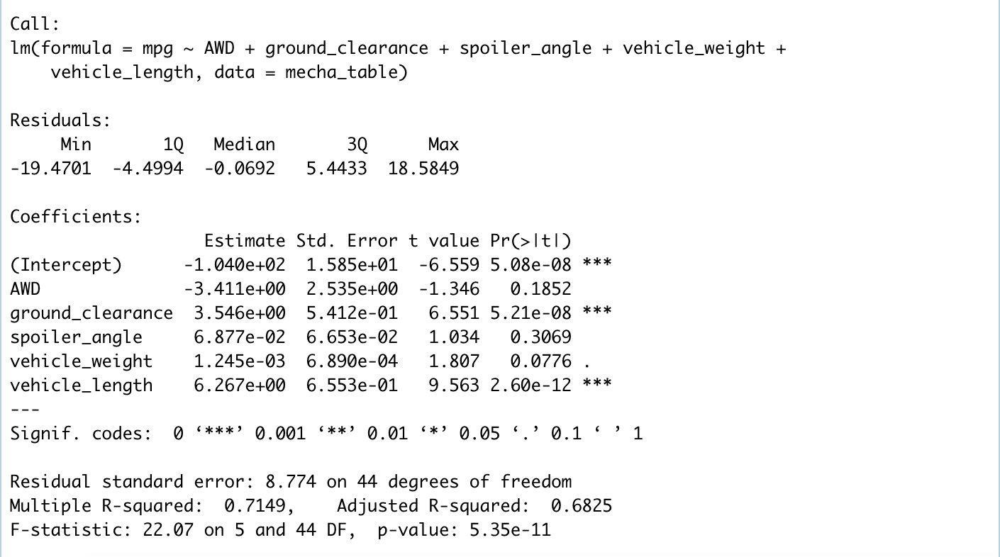

# MechaCar_Statistical_Analysis
Analyzing vehicle production metrics using R.

## Overview
AutosRUs is developing a new prototype vehicle called the MechaCar. While in production, the team encountered some setbacks that delayed the manufacturing team's progress. The goal of this project is to perform statistical analysis using RScripts to analyze the production data and provide insights that may help the manufacturing team. 

## Linear Regression to Predict MPG
First, the team must perform multiple linear regression analysis to identify which variables in the dataset predict the mpg of MechaCar Prototypes. Measurements from 5 variables were collected and used for this analysis:

1. Vehicle Length
2. Vehicle Weight
3. Spoiler Angle
4. Ground Clearance
5. All Wheel Drive (AWD) or Front Wheel Drive (FWD)

### Hypotheses
* *Null Hypothesis (H0): The slope of the linear model is zero.*

* *Alternative Hypothesis (HA): The slope of the linear model is not zero.*

### Results

Our multiple linear regression analysis demonstrates that 2 of the 5 variables contribute a non-random amount of variance to the mpg values in the dataset: 
* Ground Clearance (p-value: 5.21e-08)
* Vehicle Length (p-value: 2.60e-12)

The p-value from this analysis was 5.35e-11, which is much smaller than our significance level of 0.05. Therefore, we have sufficient evidence to reject the null hypothesis - the slope is not equal to 0.

The slope of this model is 0.71, indicating a moderately strong likelihood (>70% chance) that this model can be used to predict mpg values in the dataset. 

## Summary Statistics on Suspension Coils
Next, the team wanted to know if the manufacturing process for the suspension coils is consistent across production lots. The design specifications for the MechaCar suspension coils dictate that the variance of the suspension coils must not exceed 100 PSI. 

For this analysis, we generated a summary statistics table of the pounds per square inch (PSI) of the suspension coils from each manufacturing lot.

### Results

A summary of the entire dataset (including all manufactuirng lots) shows that the mean PSI of the suspension coils is 1498.78 with a variance of 62.29. Because the variance is less than 100, the manufacturing data meets the design specification for all manufacturing lots in total.

Looking at each lot individually, we can see that all lots (1-3) produce similar mean PSI values (~1500 PSI), however Lot3 produces extremely high variance (170.28) compared to Lot1 and Lot2 (0.97 and 7.46 respectively).

Lot1 and Lot2 meet the design specification, but Lot3 does not since the variance produced by this lot exceeds 100. 

## T-Test on Suspension Coils
Because the summary results from the suspension coils data revealed lot to lot variability that falls outside the design specifications, we next performed t-tests to determine if all manufacturing lots, and each lot individually are statistically different from the population mean of 1,500 PSI.

### Hypotheses

* *H0: There’s no statistical differences between the observed sample mean and its presumed population mean.*

* *HA): There’s a statistical difference between the observed sample mean and its presumed population mean.*

### Results

Comparing the PSI values from all manufacturing lots to the population mean produces a p-value of 0.06, which does not pass our signficance level of 0.05. Therefore, we do not have enough evidence to reject the null hypothesis. This means that when analyzing PSI values from all manufacturing lots combined, there is not significant variation in the lots compared to the population mean. 

Comparing the PSI values from Lot1 to the population mean produces a p-value of 1. Therefore we fail to reject the null. PSI values from Lot1 are not significantly different from the population mean. This is not unexpected because the lot summary table from above shows a mean value of 1,500 PSI with a variance of 0.97 PSI for Lot1.

Comparing the PSI values from Lot2 to the population mean produces a p-value of 0.60, which does not meet our signficance level of 0.05. Therefore we fail to reject the null. PSI values from Lot2 are not significantly different from the population mean. 

Comparing the PSI values from Lot3 to the population mean produces a p-value of 0.04. This does meet our significant level of 0.05 meaning that we have enough evidence to reject the null. PSI values from Lot3 are significantly different from the population mean. This supports our previous findings from the summary table, which revealed that the variance in PSI values from Lot3 did not meet the design specificaiton for the amount of variance allowed. 

### T-Test Summary
* :white_check_mark: Lot1 - Meets design specifications
* :white_check_mark: Lot2 - Meets design specifications
* :x: Lot3 - Does not meet design specifications

## Study Design: MechaCar vs Competition

### Goal
The team is getting closer to releasing their first version of the new MechaCar, but before they can introduce it to the world the team would like to know how it performs against the competition. 

### Metrics
The MechaCar was designed to be incredibly fast, while employing the latest in safety technology and crash prevention. Therefore, the team would like to know how the MechaCar's horse power and safety rating compare to the competition. 

They will be comparing the metrics from the MechaCar, to it's top competitor, the SuperCharge. 

### Horse Power 
#### Hypotheses
* *H0: There is no statistifcal difference in the mean horsepower between the MechaCar and the SuperCharge.

* *HA: There is a statistical difference in the mean horsepower between the MechaCar and the SuperCharge.

#### Statistical Test
A two-sample T-Test will be used to perform this analysis since the independent variable is dichotomous (MechaCar vs. SuperCharge) and the dependent variable (horsepower) is continuous. 

#### Required Data
The team will calculate horsepower by measuring each vehicle's torque and tire rotations per minute (RPM) on a dynamometer, and compare that to similar data collected from the SuperCharge. 

### Safety Rating
#### Hypotheses
* *H0: There is no difference if frequency distribution of safety ratings between the MechaCar and the SuperCharge.

* *HA: There is a difference in frequency distribution of safety ratings between the MechaCar and the SuperCharge.

#### Statistical Test
A Chi-Squared test will be used to perform this analysis since both the independent variable (MechaCar vs. SuperCharge) and the dependent variable (safety rating) are categorical. 

#### Required Data
The safety rating will be collected from MechaCars across multiple lots during crash testing and compared to crash test ratings from the SuperCharge. 

### Summary
Using R to perform statistical analyses, the team will be able to make informed decisions about the development and manufacturing processes so that they can release a vehicle that's both speedy and safe. 